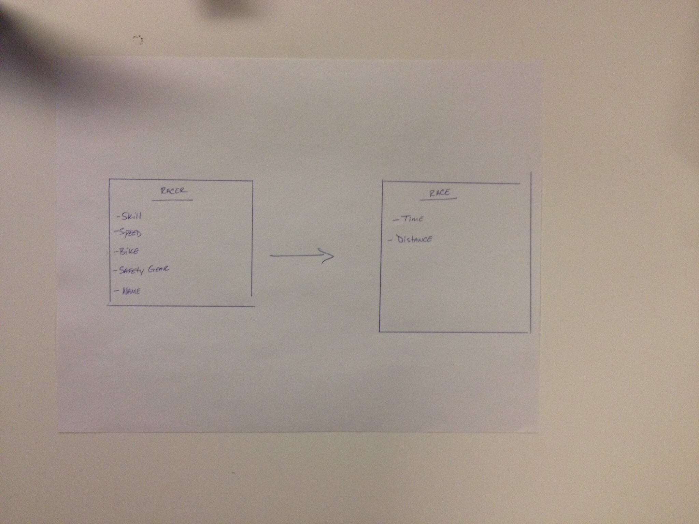

##Drag Race

Before the race, the rider needs to have proper safety gear to compete. After the safety check is complete, the rider and his bike make their way to the starting line. Track distance is 8 miles and outcome is dependent on the racer's skill level, bike, speed. The race will complete when the rider succesfully travels the distance of the track once. The goal is to log the time is takes for the rider to complete this course. 

